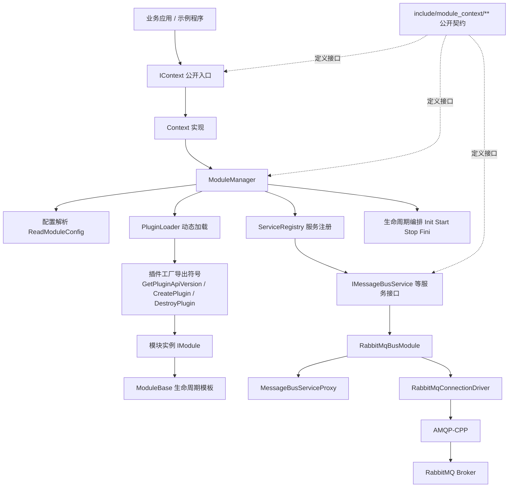
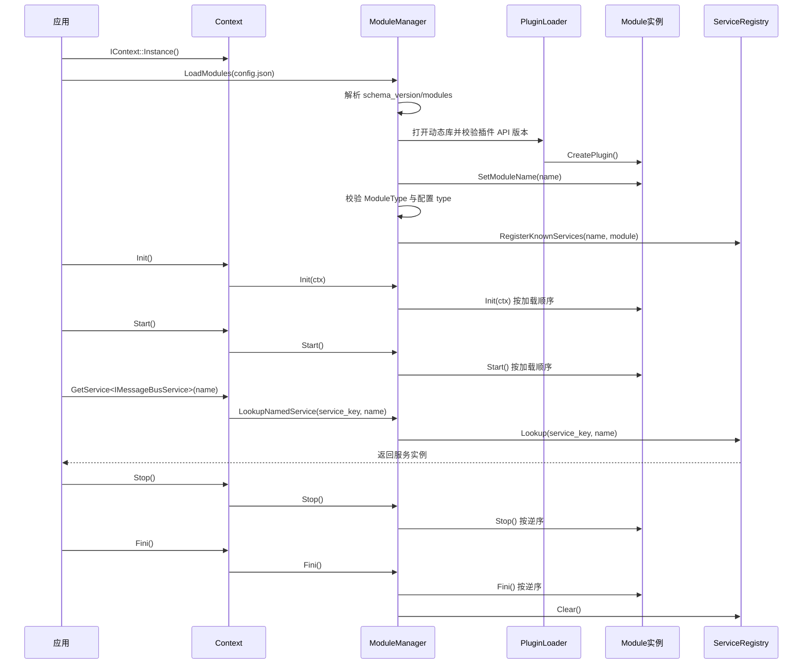
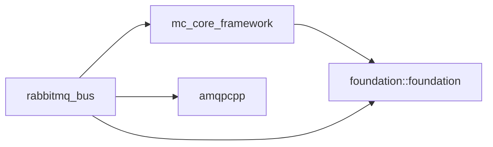

# Module-Context 项目架构图

## 1. 总览

`Module-Context` 是一个围绕“模块动态加载 + 生命周期管理 + 服务发现”构建的核心框架层项目。

它的核心职责不是承载业务，而是提供一套统一运行时，用来完成：

- 模块配置解析
- 动态库加载与插件实例创建
- 模块生命周期编排
- 服务接口注册与查询
- 具体模块能力接入（当前内置 `rabbitmq_bus`）

## 2. 分层架构图



## 3. 目录映射图

```text
Module-Context
├── include/module_context/
│   ├── framework/              # 对外公开的上下文、模块、管理器、状态接口
│   └── messaging/              # 对外公开的消息总线服务接口与消息类型
├── src/
│   ├── framework/              # Context、ModuleManager、ModuleBase、ServiceRegistry
│   └── plugin/                 # 插件工厂 ABI 宏
├── modules/
│   └── rabbitmq_bus/           # 内置 RabbitMQ 消息总线模块
├── examples/                   # 最小使用示例
├── tests/                      # 生命周期、配置解析、插件集成、RabbitMQ 模块测试
└── docs/                       # 架构与模块开发文档
```

## 4. 运行时主链路



## 5. 核心对象职责图

| 对象 | 角色 | 主要职责 |
|---|---|---|
| `IContext` | 对外统一入口 | 驱动上下文生命周期，提供服务查询入口 |
| `Context` | 默认实现 | 持有 `ModuleManager`，转发生命周期和服务查询 |
| `IModuleManager` | 模块管理契约 | 加载模块、读取模块配置、查询模块实例 |
| `ModuleManager` | 运行时核心调度器 | 配置解析、插件实例创建、模块顺序管理、服务注册 |
| `IModule` | 模块最小抽象 | 暴露模块名、类型、版本、生命周期状态 |
| `ModuleBase` | 生命周期模板基类 | 封装状态流转校验和 `OnInit/OnStart/OnStop/OnFini` 钩子 |
| `ServiceRegistry` | 服务发现组件 | 按 `service_key + name` 保存服务提供者并支持唯一查询 |
| `RabbitMqBusModule` | 具体模块实现 | 同时是模块实例，也是 `IMessageBusService` 提供者 |
| `MessageBusServiceProxy` | 服务代理 | 对外暴露稳定服务方法，对内转发给连接驱动 |
| `RabbitMqConnectionDriver` | 基础设施驱动 | 管理 socket、AMQP 连接、拓扑声明、消费者启动、重连 |

## 6. 依赖关系图



## 7. 当前架构特点

1. **公开契约和内部实现边界清晰**，`include/module_context/**` 是主要 SDK 面。
2. **框架层与具体模块解耦**，框架不直接写死 RabbitMQ 逻辑，只在服务识别上有一层白名单耦合。
3. **插件模型清晰**，通过固定 C ABI 导出符号完成跨动态库创建与销毁。
4. **服务发现与模块实例查询分离**，让“模块对象”和“模块提供的能力”成为两个不同层面的概念。
5. **RabbitMQ 模块目前是最复杂的实现样板**，也承担了框架可扩展性的主要验证。
