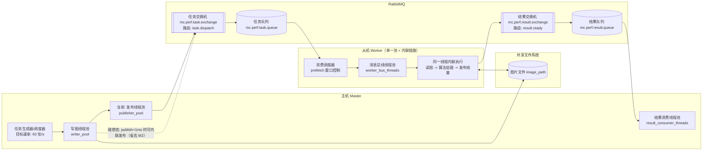
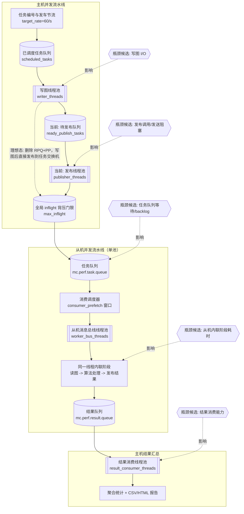

# RabbitMQ 一主五从压测说明

## 场景目标

在现有 `rabbitmq_bus` 真实 RabbitMQ 验证环境上，扩展出一主五从竞争消费的高并发压测场景：

- 主机生成约 20MB 图片并发布 `task_id + image_path`
- 5 个 worker 进程竞争消费任务
- worker 读取图片、模拟处理、发布结果
- 主机消费结果并汇总性能数据
- worker 默认在处理后删除输入图和输出图，避免压测时磁盘持续打满
- 产出 HTML 可视化报表，明确说明测试条件、背景假设和关键结果

## 新增目录

- `tests/integration/rabbitmq_perf/`
  - `common.{h,cpp}`: 公共消息结构、RabbitMQ harness、文件工具
  - `master_perf.cpp`: 主机压测入口，负责写图、限速发布、收集结果、落盘 CSV
  - `worker_perf.cpp`: worker 压测入口，负责竞争消费、阶段耗时采集、清理文件
  - `docker-compose.yml`: 独立 RabbitMQ 实例，默认端口 `5673/15673`
  - `bootstrap_rabbitmq.sh`: vhost、账号、权限、拓扑初始化
  - `run_perf_test.sh`: 一键启动压测并生成报表
  - `show_perf_status.sh`: 查看容器、队列、日志、报表
  - `cleanup_perf_env.sh`: 清理环境
  - `monitor_perf.py`: 采集 RabbitMQ 队列深度
  - `generate_perf_report.py`: 生成 HTML 报表

## 关键指标

主机侧：

- 单张图片写盘耗时
- Publish 调用耗时
- 实际发布吞吐

worker 侧：

- 队列等待耗时
- 图片读取耗时
- 模拟处理耗时
- 输出写回耗时
- 清理耗时
- 单任务总耗时

全局：

- 完成吞吐
- 成功/失败数量
- 队列 backlog / unacked 峰值
- 每个 worker 的任务分布
- 端到端延迟 P50 / P95 / P99

## 全链路拓扑图（单图 + 并发）

### 1) 单图全链路（主从通信，含理想态）

> **E2E 标题：`E2E：任务生成(60/s) -> 写图/处理(重) -> 发布(轻) -> 结果聚合`**




### 2) 并发调度与瓶颈图（队列 / 线程池 / 背压，含理想态）




### 图中元素对应到实现

- **RabbitMQ 队列/交换机**：`mc.perf.task.exchange -> mc.perf.task.queue` 与 `mc.perf.result.exchange -> mc.perf.result.queue`（routing key 分别为 `task.dispatch` / `result.ready`）。
- **Master 并发调度**：`scheduled_tasks`、`ready_publish_tasks` 两级内存队列 + `writer_pool` + `publisher_pool` + `max_inflight` 背压门限。
- **Worker 并发消费**：`worker_bus_threads` 与 `consumer_prefetch` 决定并行处理窗口；单任务内部包含读图、算法处理、输出/清理、发布结果。
- **结果汇总并发**：`result_consumer_threads` 负责并发消费结果队列并落盘指标（CSV/HTML）。

### 从机侧并发模型（回答常见疑问）

1. **从机侧有没有“线程和队列”？有。**
   - RabbitMQ 队列：
     - 消费输入：`mc.perf.task.queue`
     - 发布输出：`mc.perf.result.exchange -> mc.perf.result.queue`
   - 从机线程：由 `worker_bus_threads` 配置的消息总线 worker pool 承担消费回调执行。

2. **读图和算法处理是在同一线程池还是分开？**
   - 在当前实现中，二者都在同一个消费回调执行路径内完成，属于同一 `worker_bus_threads` 线程池中的同一条 worker 线程连续执行（不是拆分线程池）。

3. **结果发布是内联还是独立线程池？**
   - 当前从机实现是**内联发布**：在消费回调里完成读图/处理后，直接 `bus->Publish(result)`。
   - 从机侧没有额外的“结果发布专用线程池”。

4. **并发含义如何理解？**
   - `worker_bus_threads` 决定“同时有多少条任务回调在跑”。
   - `consumer_prefetch` 决定“每个消费者可预取的未确认消息窗口”。
   - 这两个参数共同决定从机侧并发上限与背压行为。

## 运行方式

构建后可执行：

```bash
bash tests/integration/rabbitmq_perf/run_perf_test.sh \
  build/tests/mc_rabbitmq_perf_master \
  build/tests/mc_rabbitmq_perf_worker \
  build/tests/rabbitmq_perf_runtime
```

常用环境变量：

```bash
MC_WORKER_COUNT=5
MC_TASK_COUNT=120
MC_TARGET_RATE=60
MC_IMAGE_BYTES=20971520
MC_SIMULATE_PROCESS_MS=80
MC_KEEP_ENV=1
# 使用外部本机 RabbitMQ（非 compose 默认端口）时：
RABBITMQ_PORT=5672
RABBITMQ_API_URL=http://127.0.0.1:15672/api
RABBITMQ_ADMIN_USER=guest
RABBITMQ_ADMIN_PASS=guest
# 跳过 compose up/down（例如外部 RabbitMQ 已在运行）
MC_COMPOSE_BIN=true
```

查看状态：

```bash
bash tests/integration/rabbitmq_perf/show_perf_status.sh \
  build/tests/rabbitmq_perf_runtime
```

清理环境：

```bash
bash tests/integration/rabbitmq_perf/cleanup_perf_env.sh \
  build/tests/rabbitmq_perf_runtime
```

连 runtime 一起删：

```bash
MC_REMOVE_RUNTIME=1 \
  bash tests/integration/rabbitmq_perf/cleanup_perf_env.sh \
  build/tests/rabbitmq_perf_runtime
```

## 背景说明

这套压测环境是**单机场景拟真**：

- RabbitMQ 跑在本机 Docker/Colima 中
- 主进程和 5 个 worker 都在同一台机器上
- 图片通过本地共享目录传递
- 处理耗时是模拟值，不等同于真实图像算法耗时

因此，这份报告更适合：

- 看模块改动前后的性能趋势
- 暴露 RabbitMQ 拓扑、限流、排队、磁盘 IO 等瓶颈
- 验证 1 主多从竞争消费链路是否稳定

不应直接把结果当成真实多机产线容量结论。
